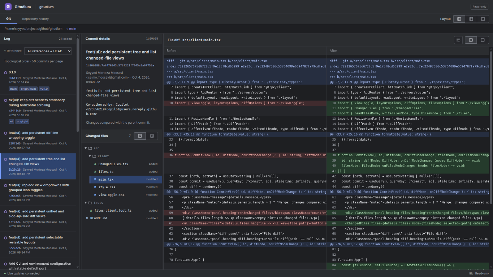

# Gitudium

**Browse local Git history in a read-only browser workspace.**

Gitudium lets you explore commits, filter history by reference, and inspect file changes without leaving your machine. It does not modify your repository.



## Features

- **Explore history:** browse a compact commit graph with branch and tag labels, filter by reference, and load more history as needed. Main branches, development branches, and HEAD take priority from left to right; first-parent histories stay straight, side branches fork right and connect near their first unique commit, and disconnected histories reuse free space. Every merge parent is connected, roots have double-dot markers, and unloaded parents remain open at the bottom.
- **Inspect commits:** read commit messages, author information, and changed files.
- **Compare changes:** switch between unified and side-by-side text diffs, with line numbers and optional line wrapping.
- **Navigate files:** choose a flat list or a collapsible folder tree.
- **Arrange your workspace:** choose from three layouts and resize independently scrolling panes. Layout, pane sizes, and view preferences are remembered in your browser.
- **Stay up to date:** commits, branch switches, and reference changes refresh the view automatically.

## Install and launch

### Requirements

- [Bun](https://bun.sh/) **1.3.14 or newer**, available on your `PATH`.
- [Git](https://git-scm.com/) **2.43.0 or newer**.

Gitudium has been validated on Linux. Other platforms and older runtime versions have not been validated.

### Download

Download the `gitudium` asset from the [latest GitHub release](https://github.com/smmoosavi/gitudium/releases/latest).

Make it executable, then launch it with the path to the repository you want to browse:

```sh
chmod +x ./gitudium
./gitudium /path/to/repository
```

If you launch it from inside a repository, the directory argument is optional. Repository subdirectories and linked worktrees are also supported.

The download is a **single executable JavaScript file, not a native binary**. It bundles the application and frontend assets, but still requires Bun and Git. There is no npm package to install, and you do not need a project checkout or adjacent files.

Alternatively, invoke it directly with Bun:

```sh
bun ./gitudium /path/to/repository
```

### Open the viewer

Open the **full URL printed in the terminal**, including its `#token=…` fragment. By default, Gitudium serves the viewer at `http://127.0.0.1:9171/`.

Keep the terminal running while you browse. Press **Ctrl+C** to stop the server.

## Browse a repository

1. Choose or type **References** in the log pane. An empty selection shows **All references + HEAD**. Autocomplete groups refs by namespace, including custom namespaces such as `refs/agents`. Typing a nonempty token automatically highlights the first matching suggestion; press **Enter** or **comma** to select it, or use **Up/Down** to choose a different suggestion. Clicking also selects a suggestion. A comma starts the next selection. An empty token (including after a trailing comma) does not automatically select anything; **Enter** applies the existing selections without adding another ref. Press **Enter** to apply typed expressions. Suggestions appear in this order: **all**, **HEAD**, local branches, remote branches, other ref namespaces, then tags. Click a namespace heading to collapse or expand its suggestions. Select or type `all` for all refs + HEAD; it can also be combined with exclusions, such as `all, !refs/agents/*`. Examples: `HEAD, main, origin/main`, `main, !vis`, `main, !refs/agents/*`, `my-feature`, and `docs/*`. Positive selections combine histories; `!` excludes matching refs and all commits reachable from them (including shared ancestors). Wildcards match full ref names or branch/tag/remote shorthand. A negative-only expression starts from all refs + HEAD; an unmatched wildcard selects no refs. Clear the field to restore all history.
2. Select a commit to see its details and changed files.
3. Select a changed file to view its diff.
4. Scroll through history. The initial request loads up to 10,000 commit summaries in topological order; another chunk loads automatically near the bottom. Loaded chunks stay in browser memory without a total-count cap, while only visible rows and a small overscan are rendered. Commit messages, changed files, and diffs load when selected. Git output is still subject to the server's 8 MiB per-command safety limit.

Pagination cursors contain only a fixed-size snapshot ID and an offset, so URLs do not grow with the number of references. The server retains immutable history tips for the 128 most recently used snapshots, preserving pagination order when references change. After server restart or snapshot eviction, reload history to obtain a new cursor.

The history chunk size and server request maximum share `HISTORY_CHUNK_SIZE` in [src/repository/limits.ts](src/repository/limits.ts). Change that constant to tune both together. Timeout durations and scroll distances are unrelated settings.

The graph keeps its lane layout while sizing its display to visible rows and overscan, including passing connections. Its width is capped at 35% of the log pane or 180 px, whichever is smaller; expansion starts immediately and shrinking is delayed briefly to avoid jitter. Width changes animate gently over 160 ms unless reduced motion is enabled. Dense sections show a shared horizontal graph scrollbar above the list (also operable with Left/Right and Home/End), leaving commit text stationary. Rows stay 100 px tall: subjects use up to two lines, author/date stays on one line, and references show the first label plus a `+N` count. Hover truncated text or labels for the full values; selecting a commit opens its full details.

Empty and bare repositories are supported. Failed requests provide a **Retry** button.

### Keyboard navigation

The focused commit or file has an outline. Keyboard navigation moves browser focus with selection, so **Enter/Space** act on the current item. **Tab** also selects the commit or file it focuses. Press `j`/`k` to select the next/previous commit. Selecting a different commit automatically selects its first changed file in display order and loads its diff, without moving focus out of the commits pane. Press `l` to focus changed files (selecting the first file if needed), then use `j`/`k` to select files in display order. Press `l` again to focus the diff, where `j`/`k` scroll down/up. Press `h` to return from the diff to files, or from files to commits. Press `n`/`p` to select the next/previous item in the parent pane without changing focus: from files, switch commits and show their first file; from the diff, switch files and start at the top of the new diff. Selected commits and files automatically scroll into view, including during parent-pane navigation. Navigation stops at list boundaries.

In the focused diff, **Page Up/Page Down** scroll by one visible page, and **Home/End** jump to the start/end of the diff.

Arrow keys work the same way: **Down/Up** select items or scroll the diff, and **Right/Left** move focus forward/back between panes. Focused view toggles and dividers retain their own arrow-key controls.

For commits without changed files, `l` or **Right** keeps focus on commits. Selection stops at the ends of the loaded list; approaching the bottom automatically loads more history. Clicking a pane also focuses it. Shortcuts are ignored in text fields, the reference selector, and when modifier keys are held.

### Customize the view

- **Layout:** use the controls at the top right to choose three columns, a log beside files above the diff, or log and files above a full-width diff.
- **Pane sizes:** drag a divider to resize panes. Double-click it to restore the default size.
- **Changed files view:** switch between a flat list and a folder tree using the controls beside the changed-file count.
- **Diff view:** switch between unified and side-by-side comparisons using the controls in the diff heading.
- **Wrap diff lines:** use the button beside the diff-view controls to wrap long lines instead of scrolling horizontally.

Changing the layout or file view keeps your current commit and file selected. Preferences persist across reloads when browser storage is available.

The view toggles support **Tab**, **Enter/Space**, **Left/Right**, and **Home/End**. Focus a divider and use **Left/Right** for vertical dividers or **Up/Down** for horizontal dividers; **Home/End** move to the size limits.

### How changes are displayed

- Regular commits are compared with their parent; merge commits are compared with their **first parent**.
- A repository's first commit is compared with an empty tree.
- Added and deleted files always use unified diffs, without changing your saved diff preference.
- Renames appear as a deletion and an addition.
- Binary files show a status message rather than a text diff. Patches larger than **1 MiB** are not displayed.

### Live updates

Gitudium refreshes history when another tool creates commits, switches branches, or changes references. Your selected reference, commit, and file are preserved while history reloads from its first page.

The status bar shows the live-update connection. If it disconnects, the current view stays visible with a stale-data warning; reconnecting automatically refreshes it. A deleted selected reference is shown as unavailable rather than silently replaced.

**Uncommitted working-tree edits are not monitored or displayed.** Gitudium is a history viewer, not a staging, editing, or merge tool.

## Command-line options

```sh
./gitudium --help
./gitudium --version
./gitudium --port 8080 /path/to/repository
./gitudium -p 8080 -d /path/to/repository
```

| Option | Purpose | Default |
| --- | --- | --- |
| `-h`, `--help` | Show usage and exit | — |
| `-v`, `--version` | Show version and exit | — |
| `-p`, `--port <port>` | Choose the local server port | `9171` |
| `-d`, `--directory <path>` | Choose the repository directory | Current directory |
| `[directory]` | Positional alternative to `--directory` | Current directory |

You can also set `GITUDIUM_PORT` and `GITUDIUM_DIRECTORY`:

```sh
GITUDIUM_PORT=8080 GITUDIUM_DIRECTORY=/path/to/repository ./gitudium
```

Command-line values override environment variables. Relative directory paths are resolved from the directory where you launch Gitudium. Use either a positional directory or `--directory`, not both. Put `--` before a positional directory name that begins with a dash.

Ports must be between `0` and `65535`. Use `--port 0` to select a free port and open the URL printed at startup. If a specified port is already occupied, startup fails rather than silently choosing another port.

## Local access and privacy

Gitudium binds only to **127.0.0.1** and serves your repository locally. Each launch creates a new access token carried in the printed browser URL. The browser removes the token fragment from the address bar and keeps it in tab-scoped session storage for reloads.

- Keep the launch URL private: it grants access to the running viewer.
- Open the full launch URL when opening a new tab.
- After restarting Gitudium, use the newly printed URL; the old token no longer works.
- Do not expose or forward the server port. Use trusted repositories.

Access protection does not isolate repository contents from other processes, browser extensions, or people with access to the same machine or browser. View preferences are stored in browser local storage; if storage is blocked, preferences are temporary and a reload may require reopening the full launch URL.

## Troubleshooting

| Problem | What to do |
| --- | --- |
| Missing interpreter or Bun not found | Install Bun and ensure it is on `PATH`, or run the file with your Bun executable. |
| Permission denied when launching | Run `chmod +x ./gitudium`, or use `bun ./gitudium`. |
| Port already in use | Choose another port with `--port 8080`, or use `--port 0`. |
| Repository cannot be opened | Check that the path exists and is a Git repository or a directory inside one, and that Git is available on `PATH`. |
| Authentication fails after a restart or in a new tab | Reopen the full URL printed by the current server, including the token fragment. |
| History appears stale | Check the live-update indicator. The viewer refreshes when it reconnects; working-tree-only edits do not trigger updates. |
| No text diff is available | Binary files, oversized patches, and files with no textual changes show status messages instead of a patch. |

## Build from source

If you prefer to build your own copy, install **Node.js 24**, **pnpm 11.17.0**, Bun, and Git, then run:

```sh
git clone https://github.com/smmoosavi/gitudium.git
cd gitudium
pnpm install --frozen-lockfile
pnpm run build
./gitudium /path/to/repository
```

The build creates the single-file `gitudium` executable at the checkout root. You can copy that file elsewhere; only Bun and Git are needed to run it.
