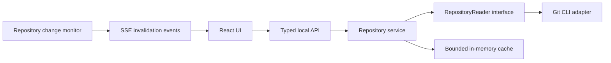

# Gitudium implementation plan

## Purpose

Build a read-only Git history viewer. A user runs `./gitudium` inside a Git repository and views that repository in a browser. This document is the working implementation guide; update its decisions and checkboxes as work progresses.

## Agreed requirements

- Distribute one bundled JavaScript file named `gitudium`.
- Assume Bun and Git are installed; document supported minimum versions after validation.
- Installation requires no package installation, `node_modules`, or external frontend assets.
- Resolve the repository from the launch working directory, including launches from a repository subdirectory.
- Keep repository data local. No database, external service, telemetry, or persistent application data is required initially.
- Use Git CLI initially, behind an application-facing interface that can support another implementation later.
- Provide live updates when repository state changes.
- Keep native executable distribution as a future option, not an initial requirement.

## Proposed stack

- **Runtime and HTTP server:** Bun and `Bun.serve()`.
- **Frontend:** React, TypeScript, and Vite.
- **API:** tRPC with runtime input validation.
- **Client state:** TanStack Query for server-query caching and invalidation.
- **Live transport:** SSE, preferably through tRPC subscriptions if the selected version integrates cleanly with Bun. Otherwise use one dedicated SSE endpoint, not two overlapping transports.
- **Git execution:** Bun subprocess API with argument arrays, without a shell.
- **Build:** Build the frontend, embed its assets in a generated module, and bundle that module with the backend for Bun.
- **Tests:** Bun's test runner for backend/unit tests; select a minimal browser-testing approach when implementing the UI.

These are implementation defaults. Record any necessary changes here before expanding the architecture.

## Architecture

### Repository boundary

Define normalized application types and a `RepositoryReader` interface for operations such as:

- Repository metadata and capabilities.
- Paged history queries.
- Reference listing.
- Commit details.
- Commit and file diffs.

Do not expose arbitrary Git command execution through this interface or the API. Keep subprocess execution, output parsing, Git paths, and CLI-specific errors inside the adapter. Public results should be serializable and should not depend on wrapper-library types.

Pagination semantics, revision selection, and diff behavior must be explicit and covered by contract tests. A replacement adapter must match those contracts; an interface alone does not guarantee equivalent behavior.

### Repository resolution and lifecycle

- Capture the launch working directory once.
- Resolve repository root, Git directory, and common Git directory using Git itself.
- Support linked worktrees, where `.git` may be a file.
- Return a clear error when outside a repository or when Git is unavailable.
- Handle an empty repository without treating it as a startup failure.
- Pass an explicit working directory to every Git subprocess.
- Bind to `127.0.0.1` on an available port and serve API and UI from the same origin.
- Print the browser URL; browser auto-opening is best effort and must not prevent startup.
- Close watchers, connections, and subprocesses on shutdown.

### Git CLI adapter

- Execute fixed commands with validated argument arrays; never interpolate a shell command.
- Disable pagers, colors, prompts, and external diff/text-conversion execution where relevant.
- Use explicit machine-oriented formats and separators rather than parsing human-formatted output.
- Validate revisions and paths, including option-like inputs and revision/path ambiguity.
- Bound history pages, diff output, subprocess concurrency, and cache memory.
- Handle unusual filenames, binary files, command failures, and cancellation explicitly.
- Keep stdout and stderr separate and normalize errors for the API.

### Live queries

Implement invalidation-based reactivity, not a database or a general dependency-tracking engine.

1. Fetch data through typed queries.
2. Monitor resolved repository metadata directories for changes.
3. Debounce filesystem events and classify changes conservatively.
4. Emit invalidation events to connected clients.
5. Invalidate affected TanStack Query keys and refetch active queries.

Watchers are hints, not the sole source of truth. Add a lightweight periodic fingerprint check for relevant refs and HEAD, including packed refs, as a fallback. Reconcile after reconnect so missed events do not leave stale views. Preserve query filters and selected commits during refresh.

Cache commit details by immutable object ID. Invalidate ref-dependent history and reference queries when refs or HEAD change. Working-tree watching is deferred until status or uncommitted-diff features are introduced.

### Local API protection

- Bind only to loopback by default.
- Validate Host and Origin for applicable requests to protect against unrelated websites and DNS rebinding.
- Generate a per-launch access token and establish authenticated browser access without persisting credentials.
- Avoid leaking the token through external requests or logging it beyond the intended launch URL.
- Expose only read-only, repository-scoped operations.

## Initial product scope

The following is a proposed MVP, not a commitment to every possible Git viewer feature:

- Repository identity and current branch.
- Paginated commit history with subject, author, date, short hash, and reference labels.
- Branch/reference selection.
- Commit details and changed-file list.
- On-demand file diffs with binary and oversized-output states.
- Live refresh following commits, branch switches, and ref changes.
- Loading, empty, disconnected, and error states.

Defer interactive Git mutations, multiple repositories, remote network operations, full graph layout, working-tree status, advanced search, and persistent preferences. Confirm consequential UX choices before implementation, especially merge-diff behavior and history ordering/filter semantics.

## Single-file build and delivery

1. Build React into production assets with Vite.
2. Generate an asset manifest containing each asset's bytes and MIME type. Preserve hashed asset paths.
3. Import the manifest into the server so the Bun bundle contains every required asset.
4. Bundle backend dependencies into one Bun-targeted JavaScript output.
5. Ensure the output begins with `#!/usr/bin/env bun` and has executable permissions in Unix distribution workflows.
6. Run the artifact from a temporary repository outside the source checkout, without adjacent assets or `node_modules`.

Development dependencies are allowed in the source project; they are not an installation requirement. Source maps and other debug files must not be required by the delivered artifact. Document `bun /path/to/gitudium` as an alternative to executable invocation and validate supported platforms before claiming support.

## Implementation milestones

### 1. Project foundation

- [x] Establish Bun/TypeScript manifests, scripts, and development configuration.
- [x] Add React/Vite and minimal server entry points.
- [x] Document local development and the Bun/Git prerequisites.
- [x] Verify the browser can load the UI and call a typed API locally.

Foundation validated on Linux with Bun 1.3.14 and Git 2.43.0: TypeScript checking, three Bun HTTP API tests, the Vite production build, and a browser smoke check including manual query refetch all pass. Development uses Vite on `127.0.0.1:5173` with a same-origin `/api/trpc` proxy to Bun on `127.0.0.1:3000`. Fixed development ports are not the final application's available-port launch behavior. The current API is an input-validated health query only; repository operations and launch-token access protection remain in their planned milestones.

### 2. Repository adapter

- [x] Define domain types, reader interface, and normalized errors.
- [x] Implement repository discovery, including subdirectories and linked worktrees.
- [x] Implement refs, bounded history, commit details, and on-demand diffs.
- [x] Add fixture-based tests using disposable repositories.
- [x] Verify empty repositories, merge commits, unusual filenames, and failed Git commands.

Implemented in `src/repository/` behind `RepositoryReader`; HTTP/UI integration remains milestone 3. History defaults to all refs plus HEAD in topological order, matching the traversal intent of `git log --oneline --decorate --graph --all`. Results include parent IDs for future graph rendering, not ASCII graph columns. An optional revision selects one reachable history. Cursors pin resolved tip IDs and an offset, so later ref changes do not insert commits into subsequent pages; decoration labels reflect current branch/remote/tag refs. Missing/pruned cursor objects produce normalized errors, not a silently restarted traversal.

Merge details and diffs compare against the first parent (confirmed); root commits compare against the empty tree. Rename detection is deliberately disabled: renames appear as deletion/addition, avoiding heuristic and resource-dependent results. Paths are repository-relative literal paths, including option-like and pathspec-magic filenames. File diffs can report binary or oversized states; a whole-commit diff containing any binary patch reports binary. Pages default to 50 commits and are capped at 200; at most 4 subprocesses run concurrently per reader, history snapshots permit 4,096 tips, ordinary output is capped at 8 MiB, stderr at 64 KiB, and patches at 1 MiB. Oversized ordinary results fail explicitly. Cancellation terminates subprocesses; no shell, pager, external diff, text conversion, replacement objects, or inherited Git environment overrides are used. Disposable fixtures cover ordinary/empty/bare repositories, subdirectories, linked worktrees, detached HEAD, annotated and non-commit tags, custom refs, pinned pagination, merges, unusual paths, binary/oversized patches, invalid inputs, unavailable Git, command failures, and cancellation.

### 3. Read-only viewer

- [x] Implement history pagination, reference selection, and commit selection.
- [x] Implement changed-file navigation and file diff rendering.
- [x] Add explicit loading, empty, binary, oversized, and failure states.
- [x] Verify API contracts and the main browser navigation flow.

The typed read-only API now exposes metadata, references, bounded history, commit details, and diffs through an injected repository reader with lazy discovery from the captured launch directory. Runtime validation and normalized errors are covered by disposable-repository HTTP tests, including empty repositories, literal unusual paths, pagination, binary/oversized patches, invalid inputs, and discovery failures. The UI uses 50-commit pages, reference filtering, explicit commit/file selection, and colored unified diffs. Initial queries are sequenced to avoid saturating the adapter; window-focus refetch is disabled until live-update reconciliation is implemented. Merge/root semantics are shown in commit details. TypeScript, nine HTTP/asset tests, the production build, repository-aware artifact smoke, and browser navigation through reference selection, commit details, and a file diff pass. Live updates and access protection remain deferred; this is a development preview.

### 4. Live repository updates

- [x] Add repository change monitoring with debounce and fingerprint fallback.
- [x] Add SSE events and targeted client cache invalidation.
- [x] Handle disconnect/reconnect and clean shutdown.
- [x] Verify external commits, ref updates, and branch switches refresh active views.
- [x] Verify repeated event bursts do not produce unbounded subprocess work.

Implemented a single dedicated `/api/events` SSE transport. A lazy monitor watches resolved Git/common directories with 100 ms burst coalescing and a 2-second fingerprint fallback for HEAD, loose/custom refs, packed refs, and reftable metadata. Checks are serialized and bounded to 16,384 entries and 8 MiB, never invoke Git, and conservatively invalidate on transient failures/limits. SSE queues are bounded; abort/cancel and handler shutdown remove listeners and close resources. Development and packaged servers disable Bun's idle timeout for long-lived SSE streams.

Confirmed refresh behavior: preserve selected reference, commit, and file; sequentially refresh metadata/references, trim cached history to its first page, then refetch active history. Immutable commit details/diffs remain cached. Removed references remain selectable as unavailable. Refresh bursts coalesce into a running pass plus reconciliation; reconnect sends an initial invalidation and disconnects show a stale-data warning. Fourteen targeted tests cover watchers/polling, custom/packed refs, linked worktrees, branch switches, burst bounds, cancellation/reconnect/shutdown, and client cache behavior. TypeScript, build, isolated artifact live SSE smoke, and browser checks for external commits, branch switching, selection preservation, offline missed updates, and stable idle connections pass.

### 5. Packaging and release readiness

- [x] Embed production frontend assets and produce the single JavaScript artifact.
- [ ] Add local API access protection and validate unauthenticated/cross-origin rejection.
- [x] Smoke-test the artifact outside the checkout with no runtime package installation.
- [x] Verify startup, asset loading, the current health API, and shutdown from the artifact.
- [x] Verify repository API calls, diffs, and live refresh from the artifact once implemented.
- [x] Record validated Bun/Git versions and platform limitations for the current build.
- [x] Document single-file installation, invocation, troubleshooting, and artifact size.

Build-related work was brought forward before repository/viewer milestones. `pnpm run build` emits executable JavaScript `gitudium` with embedded frontend assets and bundled server dependencies; Bun remains the interpreter (not a native executable). `pnpm run test:artifact` validates a copied artifact in an isolated temporary directory. Linux validation used Bun 1.3.14 and Git 2.43.0. Repository features and access protection are deliberately not included in this build-only milestone.

## Validation strategy

Use the smallest relevant tests and checks during each milestone. Before release, validate the assembled artifact, not only the development server.

Required coverage includes:

- Domain parsing and input validation unit tests.
- Real Git integration tests against disposable fixtures.
- Repository discovery in ordinary repositories, subdirectories, and linked worktrees.
- Pagination boundaries and consistent behavior across ref changes.
- Live update coalescing, fallback detection, and reconnect reconciliation.
- Local access control and rejection of unsafe inputs.
- At least one browser smoke flow through history, commit details, and a diff.
- Single-file execution with only Bun and Git available as runtime prerequisites.

Clean up test repositories and generated temporary files. Do not operate on the developer's repository when testing mutations used to simulate external changes.

## Working rules

- Mark milestone checkboxes complete only after the outcome is implemented and verified.
- Update this plan when an architectural decision changes.
- Keep changes scoped to the current milestone; avoid speculative infrastructure.
- Keep user-facing documentation aligned with actual behavior.
- Do not add a database or native packaging unless a later requirement justifies it.
